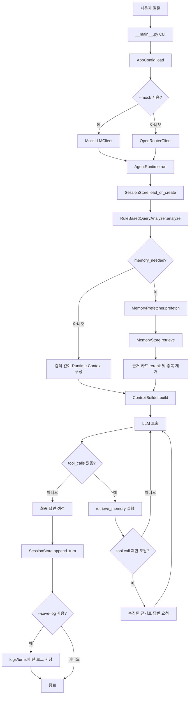
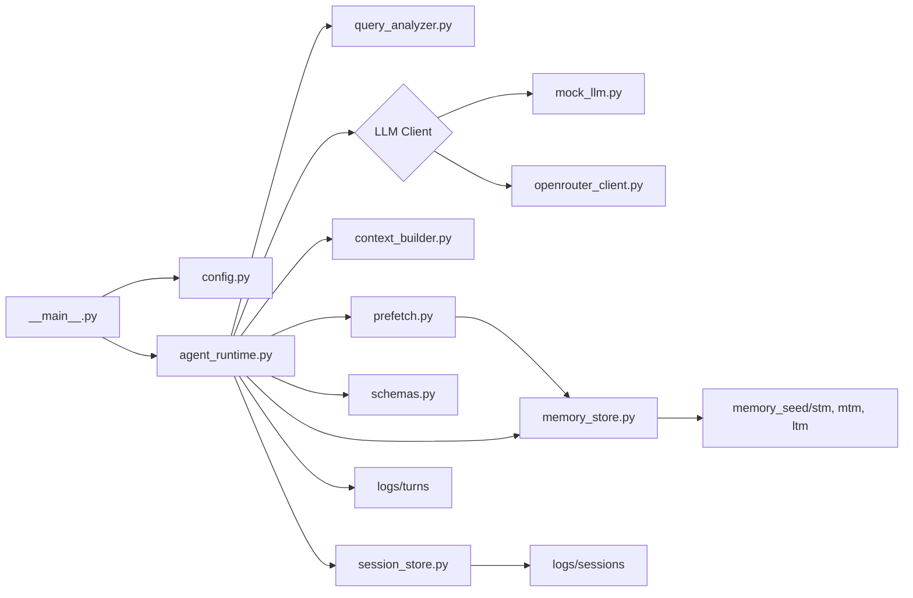

# Org AI Agent 동작 및 실행 가이드

이 문서는 `Org-AI-Agent` 프로젝트가 현재 어떤 방식으로 동작하는지와 실제 실행에 필요한 명령을 정리한다.

## 프로젝트 개요

`Org-AI-Agent`는 조직의 대화 기록, 진행 문서, 공식 기준 문서를 근거로 답변하는 세션형 에이전트 MVP다. 현재 기본 검색기는 별도 벡터 DB를 쓰지 않고 `memory_seed` 폴더의 파일을 STM, MTM, LTM 메모리처럼 읽어 검색한다.

별도로 만든 벡터 RAG 저장소(`RAG-test`)는 이 프로젝트의 에이전트 런타임에 아직 연결되어 있지 않다. 이 저장소의 현재 실행 흐름은 `memory_seed` 기반 키워드 RAG다.

## 디렉터리 구조

```text
Org-AI-Agent/
├─ org_agent_mvp/
│  ├─ __main__.py              # CLI 진입점
│  ├─ agent_runtime.py         # 한 턴 실행 루프
│  ├─ query_analyzer.py        # 질문 분석과 메모리 tier 비율 결정
│  ├─ prefetch.py              # 분석 결과 기반 사전 검색
│  ├─ context_builder.py       # LLM에 넣을 런타임 컨텍스트 생성
│  ├─ memory_store.py          # memory_seed 파일 로드와 검색
│  ├─ session_store.py         # 세션 캐시 저장
│  ├─ mock_llm.py              # API 없이 테스트하는 mock 모델
│  ├─ openrouter_client.py     # OpenRouter Chat Completions 호출
│  └─ schemas.py               # retrieve_memory tool schema
├─ memory_seed/
│  ├─ stm/                     # Short-Term Memory: 최신 대화, 당일 업무
│  ├─ mtm/                     # Mid-Term Memory: 진행 중 문서, 회의록, 초안
│  └─ ltm/                     # Long-Term Memory: 공식 기준, 최종 문서
├─ tests/
├─ docs/
└─ .env
```

## 실행 흐름

```text
사용자 질문 입력
→ logs/sessions에서 세션 캐시 로드 또는 새 세션 생성
→ RuleBasedQueryAnalyzer가 질문 의도와 검색 필요 여부 판단
→ STM / MTM / LTM 검색 비율 결정
→ MemoryPrefetcher가 비율에 맞게 memory_seed를 사전 검색
→ 검색 결과를 rerank하고 중복 제거
→ ContextBuilder가 최근 세션 턴과 근거 카드를 RUNTIME_CONTEXT로 구성
→ MockLLM 또는 OpenRouter 모델 호출
→ 모델이 필요하다고 판단하면 retrieve_memory tool call 실행
→ tool 결과를 포함해 모델을 다시 호출
→ 최종 답변과 출처 생성
→ 세션 캐시 저장
→ --save-log 사용 시 턴 전체 로그 저장
```



## 주요 모듈 관계



## 질문 분석 방식

`query_analyzer.py`의 `RuleBasedQueryAnalyzer`가 질문의 키워드를 보고 의도를 정한다.

| 조건 | intent | 기본 검색 비율 |
|---|---|---|
| 충돌, 비교, 차이, 일치 등 | `memory_comparison` | STM 35%, MTM 25%, LTM 40% |
| 아까, 방금, 오늘, 이전 턴 등 | `recent_context_lookup` | STM 65%, MTM 25%, LTM 10% |
| 공식, 최종, 기준, 지침, 정책 등 | `official_knowledge_lookup` | STM 10%, MTM 20%, LTM 70% |
| 회의록, 초안, 보고서, 진행 중 등 | `working_document_lookup` | STM 20%, MTM 65%, LTM 15% |
| 일정, 담당자, 문서, 과제, 예산 등 | `organization_memory_lookup` | STM 34%, MTM 43%, LTM 23% |
| 조직 메모리 신호가 없는 일반 질문 | `direct_answer` | 검색 없음 |

질문에 `A 과제`, `CRM 프로젝트`, `신규 사업` 같은 업무 단위명이 들어가면 `project` 필터가 설정된다. 후속 질문에서 `그 일정`, `여기서`, `위 내용`, `이어서`처럼 이전 답변을 가리키면 최근 세션 턴에서 업무 단위명을 찾아 이어받는다. 직전 질문에 업무 단위명이 없더라도 더 앞선 최근 턴에 `project` 필터가 있으면 해당 필터를 유지한다.

업무 단위명은 기본 정규화를 거친다. 예를 들어 `A과제`, `A 과제`, `A-과제`, `a과제`는 모두 `A 과제`로 처리하고, `CRM프로젝트`와 `CRM 프로젝트`도 같은 값으로 처리한다. 이 정규화는 질문 분석에서 필터를 만들 때와 `memory_seed` 문서의 `project` 메타데이터를 비교할 때 동일하게 적용된다.

## 검색 방식

현재 검색기는 `memory_store.py`의 `MemoryStore.retrieve()`다.

- 검색 대상 파일: `memory_seed/stm`, `memory_seed/mtm`, `memory_seed/ltm` 바로 아래의 `.md`, `.json`, `.txt`
- 검색 방식: 토큰 기반 키워드 점수
- 지원 필터: `project`, `source_type`, `status`, `document_types`
- 점수 보정:
  - 제목과 과제명에 query 토큰이 있으면 가산
  - `오늘`, `아까`, `최근` 계열 질문은 최신 문서 가산
  - `공식`, `최종`, `기준` 계열 질문은 LTM 문서 가산
- 반환 형태: evidence card

evidence card에는 `tier`, `title`, `date`, `project`, `summary`, `quote`, `content_excerpt`, `source_ref`, `confidence`, `retrieval_score`가 포함된다.

## Prefetch와 Tool Call

모든 메모리 질문은 먼저 prefetch를 수행한다. `PREFETCH_TOP_K` 값만큼 후보를 뽑고, 질문 분석에서 계산한 tier 비율에 따라 STM, MTM, LTM별 검색 개수를 배분한다.

LLM에는 prefetch 결과가 먼저 들어간다. 모델이 이 근거만으로 부족하다고 판단하면 `retrieve_memory` tool을 호출한다.

`retrieve_memory` tool 인자는 다음 구조다.

```json
{
  "tier": "stm | mtm | ltm | all",
  "query": "검색 문장",
  "filters": {
    "project": "A 과제",
    "source_type": "meeting",
    "status": "approved",
    "document_types": ["meeting", "report"]
  },
  "top_k": 5,
  "reason": "이 검색이 필요한 이유"
}
```

한 턴에서 tool call은 최대 3회까지 허용된다. 같은 `tier`와 같은 `query`를 반복 호출하면 중복 검색으로 보고 차단한다.

## 세션과 로그

세션 캐시는 항상 저장된다.

```text
logs/sessions/session-YYYYMMDD-HHMMSS-xxxxxx.json
```

세션 파일에는 최근 턴의 질문, 답변 요약, 출처 ID, query intent가 저장된다. 기본 보관 턴 수는 `SESSION_CACHE_TURNS=8`이다.

각 세션 턴에는 다음 실행 요약도 함께 저장된다.

- `query_analysis`: 질문 intent, tier 비율, query rewrite, project 필터
- `prefetch`: tier별 검색 배분, 후보 개수, 후보 source ID
- `reasoning_steps`: LLM 호출별 결정 요약, 다음 액션, tool call 요청 요약
- `tool_calls`: 실행된 tool, 검색 tier, query, reason, 결과 개수
- `stopped_reason`: 최종 답변, tool 제한 도달 등 종료 이유

다음 턴의 `RUNTIME_CONTEXT`에는 최근 세션 턴의 질문, 답변 요약, intent, project, source ID, tool call 요약이 포함된다. 그래서 `여기서`, `그 일정`, `위 내용`처럼 이전 답변을 가리키는 질문에서 이전 과제 맥락을 이어받을 수 있다.

`--save-log`를 붙이면 한 턴의 상세 로그가 추가로 저장된다.

```text
logs/turns/YYYYMMDD-HHMMSS-xxxxxxxx.json
```

턴 로그에는 query analysis, prefetch, LLM 호출, tool 실행, 최종 trace, transcript가 포함된다.

`logs/`는 `.gitignore`에 포함되어 있으므로 Git에 올라가지 않는다.

## 환경 설정

프로젝트 루트의 `.env`를 사용한다. 키 값은 외부에 노출하지 않는다.

```env
OPENROUTER_API_KEY=...
OPENROUTER_MODEL=google/gemini-3.7-flash:batch
OPENROUTER_BASE_URL=https://openrouter.ai/api/v1
OPENROUTER_APP_NAME=Org Agent MVP
OPENROUTER_SITE_URL=http://localhost
PREFETCH_TOP_K=8
SESSION_CACHE_TURNS=8
```

`--mock` 옵션으로 실행하면 `OPENROUTER_API_KEY`가 없어도 동작한다. 실제 모델 호출을 하려면 `.env`에 `OPENROUTER_API_KEY`가 필요하고 `--mock`을 빼야 한다.

## 기본 실행 명령

아래 명령은 PowerShell 기준이다.

먼저 프로젝트 루트로 이동한다.

```powershell
cd "C:\Users\ATIV\Desktop\조직축적AI플랫폼\Org-AI-Agent"
```

API 없이 구조만 확인하는 단발 실행:

```powershell
python -m org_agent_mvp --mock --verbose --trace --question "A 과제의 최근 내부 목표일이 공식 계획과 충돌해?"
```

API 없이 상세 턴 로그까지 저장하는 단발 실행:

```powershell
python -m org_agent_mvp --mock --verbose --trace --save-log --question "A 과제의 최근 내부 목표일이 공식 계획과 충돌해?"
```

API 없이 대화형 세션 실행:

```powershell
python -m org_agent_mvp --mock --verbose
```

실제 OpenRouter 모델로 단발 실행:

```powershell
python -m org_agent_mvp --verbose --trace --question "A 과제의 최근 내부 목표일이 공식 계획과 충돌해?"
```

실제 OpenRouter 모델로 대화형 세션 실행:

```powershell
python -m org_agent_mvp --verbose
```

기존 세션 이어가기:

```powershell
python -m org_agent_mvp --mock --verbose --session-id "session-YYYYMMDD-HHMMSS-xxxxxx"
```

기존 세션에 단발 질문 추가:

```powershell
python -m org_agent_mvp --mock --verbose --session-id "session-YYYYMMDD-HHMMSS-xxxxxx" --question "그 일정은 누가 담당하기로 했어?"
```

턴 로그 저장 위치를 직접 지정:

```powershell
python -m org_agent_mvp --mock --save-log --log-dir "logs\turns" --question "오늘 회의 action item 알려줘"
```

대화형 모드 안에서는 다음 명령을 쓴다.

```text
exit 또는 quit: 종료
/new: 새 세션 시작
```

## 테스트 명령

전체 unittest 실행:

```powershell
python -m unittest discover -s tests -v
```

특정 테스트 파일만 실행:

```powershell
python -m unittest tests.test_agent_flow -v
```

## 로그 확인 명령

세션 로그 목록 확인:

```powershell
Get-ChildItem "logs\sessions"
```

최신 세션 로그 내용 확인:

```powershell
Get-ChildItem "logs\sessions" | Sort-Object LastWriteTime -Descending | Select-Object -First 1 | Get-Content
```

턴 로그 목록 확인:

```powershell
Get-ChildItem "logs\turns"
```

최신 턴 로그 내용 확인:

```powershell
Get-ChildItem "logs\turns" | Sort-Object LastWriteTime -Descending | Select-Object -First 1 | Get-Content
```

## Verbose 출력 의미

`--verbose`를 붙이면 실행 중 다음 이벤트가 터미널에 출력된다.

```text
[session]     세션 ID와 이전 턴 수
[turn]        사용자 질문
[analyzer]    질문 의도, 검색 필요 여부, tier 비율
[prefetch]    사전 검색 배분과 후보
[context]     LLM에 들어간 최근 턴 수와 근거 수
[llm]         모델 호출 시작과 종료
[reasoning]   tool call 또는 final answer 결정 요약
[tool]        retrieve_memory 실행 정보와 결과 출처
[final]       최종 답변 준비 완료
```

`[reasoning]`은 모델의 숨겨진 사고 과정을 출력하는 것이 아니라, 응답 메시지와 tool call에서 확인 가능한 실행 결정을 요약한 것이다.

## 실제 운영 시 주의점

- 현재 `memory_seed` 검색은 벡터 검색이 아니라 키워드 검색이다.
- `memory_seed`의 하위 tier 폴더 바로 아래 파일만 읽는다. 더 깊은 하위 폴더는 검색하지 않는다.
- 업무 단위명은 `A과제`, `A 과제`, `A-과제`, `CRM프로젝트`, `CRM 프로젝트`처럼 흔들리는 표기를 같은 값으로 정규화한다.
- `.md` 파일은 YAML frontmatter가 있으면 메타데이터로 사용한다.
- `.json` 파일은 전체 JSON을 본문처럼 검색하고, `body`, `content`를 제외한 필드는 메타데이터로 쓴다.
- OpenRouter 실제 호출은 네트워크 상태와 모델 상태에 따라 지연될 수 있다.
- `google/gemini-3.7-flash:batch`처럼 batch 모델을 쓰면 일반 실시간 모델보다 응답 특성이 다를 수 있다.
- `.env`, `logs/`, `docs/`는 현재 Git 추적에서 제외되어 있다.

## 문제가 생겼을 때

`OPENROUTER_API_KEY is empty`가 나오면 `.env`에 키를 넣거나 `--mock`으로 실행한다.

검색 결과가 없으면 질문의 과제명, `memory_seed` 파일의 `project` 메타데이터, 문서 위치를 확인한다. 현재 검색기는 `memory_seed/stm`, `memory_seed/mtm`, `memory_seed/ltm` 바로 아래 파일만 읽는다.

한글이 깨져 보이면 PowerShell 출력 인코딩을 UTF-8로 맞춘다.

```powershell
[Console]::OutputEncoding = [System.Text.Encoding]::UTF8
$OutputEncoding = [System.Text.Encoding]::UTF8
```

실제 모델 호출이 실패하면 `--mock`으로 먼저 런타임 흐름이 정상인지 확인한 뒤 `.env`의 `OPENROUTER_MODEL`, `OPENROUTER_BASE_URL`, API 키 상태를 확인한다.
